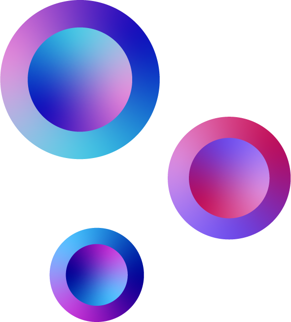

### Hi there, I'm Lachlan - aka [widelachie][website] 👋

## I'm a developer, designer and cool guy

- 🌱 I'm currently learning C++
- 👯 I’m looking to collaborate with other software developers
- 🥅 2020 Goals: Contribute more to Open Source projects
- ⚡ Fun fact: I love taekwondo and my bass!
### Contact me at me@lachlankemp.com

### What I'm good at
[

]

### What I'm learning:

[

]

### GitHub Stats

[website]: https://lachlankemp.com
[instagram]: https://instagram.com/widelachie
[email]: mailto:me@lachlankemp.com

